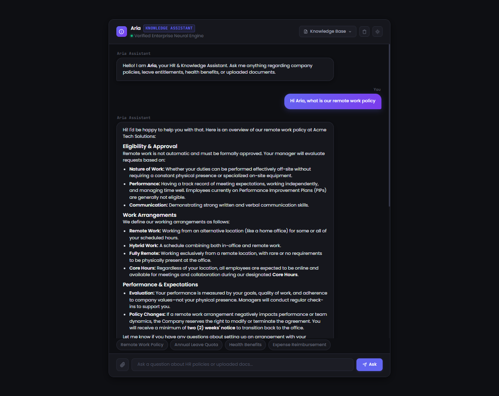
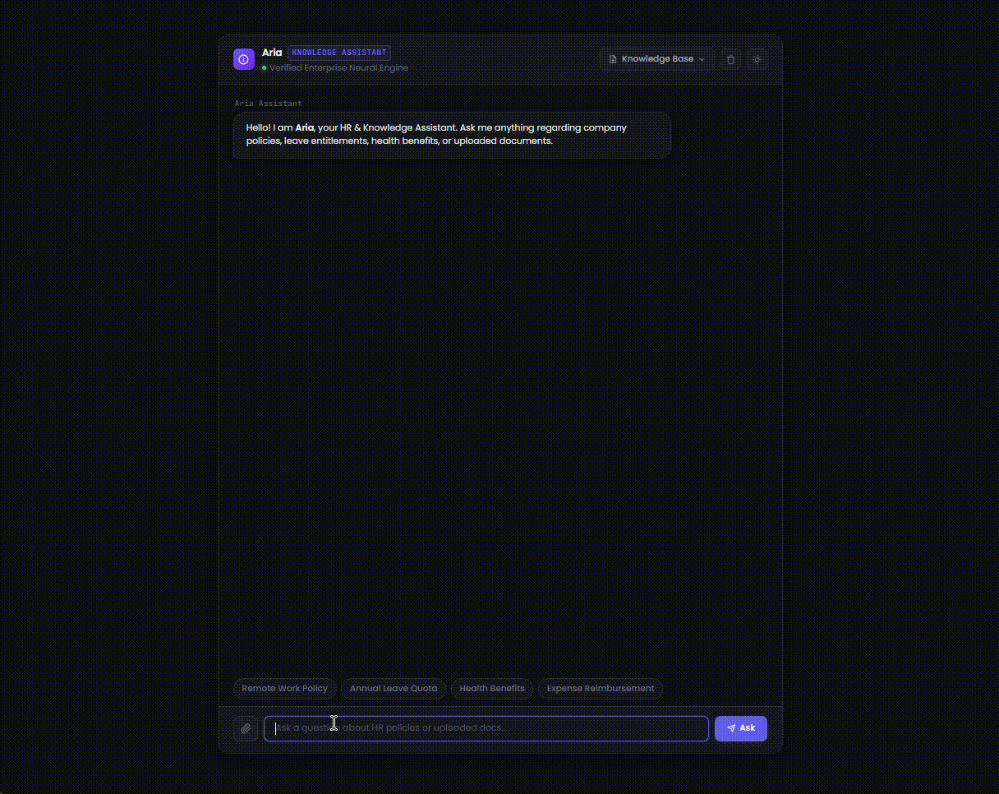

# Mafabi RAG Engine & Aria Assistant
A modular Retrieval-Augmented Generation (RAG) pipeline and REST API designed to ingest enterprise PDFs, compute vector embeddings, and deliver grounded conversational answers through Aria, an adaptive AI knowledge assistant.

<p align="center">
  
</p>

## Demo
<p align="center">
  
</p>

## The "Why"
Traditional keyword search fails when querying dense corporate handbooks, policies, and documentation. This project solves that challenge by providing an end-to-end RAG architecture with custom semantic chunking, dual-task Gemini vector embeddings, and calibrated cosine similarity thresholding to eliminate hallucinations. With both an interactive FastAPI web interface and an instant CLI mode, it serves as a lightweight, production-ready foundation for domain-specific AI front-desk assistants.

## Tech Stack
- **Python 3.8+**
- **FastAPI & Uvicorn** (Asynchronous REST API and web application server)
- **Google GenAI SDK** (`gemini-embedding-001` for task-tuned embeddings and `gemini-3.5-flash` for conversational generation)
- **PDFPlumber** (High-fidelity PDF text extraction)
- **NumPy, Pandas, Scikit-learn** (Vector mathematics and similarity scoring)
- **HTML5 & Vanilla JavaScript** (Interactive web frontend dashboard)

## Architecture / File Purposes
- **`main.py`**: Batch embedding pipeline that extracts text from PDFs, applies semantic chunking, computes embeddings, and persists vectors to storage.
- **`ask.py`**: Interactive CLI testing tool to query the vector store in real-time, inspect similarity scores, and test LLM generation in terminal.
- **`api.py`**: FastAPI application exposing `/api/upload` (dynamic document ingestion) and `/api/ask` (semantic search and generation), alongside serving the web UI.
- **`engine/`**: Decoupled core engine components:
  - `pdf_extractor.py`: Extracts and normalizes text from documents.
  - `chunker.py`: Smart heuristic chunking for prose and FAQ formats with short-chunk merging.
  - `embedder.py`: Handles Google GenAI vector generation with dedicated query and document task types.
  - `vector_store.py`: Persistence layer for vector records.
  - `search.py`: Cosine similarity retrieval with calibrated relevance thresholding (`MIN_RELEVANCE_SCORE`).
  - `generator.py`: Grounded context injection, adaptive persona prompting, and constructive response synthesis.
  - `config.py`: Centralized configuration for models, thresholds, and paths.
- **`templates/index.html`**: Clean browser dashboard for uploading PDFs and chatting with Aria.
- **`documents/pdf/`**: Source repository directory for raw input PDF documents.
- **`storage/`**: Local persistence directory housing `embeddings.json`.
- **`assets/`**: Visual artifacts including UI preview demonstrations.

## Execution

### 1. Environment Setup (Windows)

Clone the repository and navigate into the project directory:
```powershell
git clone https://github.com/Israel-Mafabi-Emmanuel/mafabi_rag_engine.git
cd mafabi_rag_engine
```

Create and activate a virtual environment:

**Using Python `venv` (Standard):**
```powershell
python -m venv .venv
.\.venv\Scripts\Activate.ps1
# If PowerShell script execution is restricted, run:
# Set-ExecutionPolicy -Scope Process -ExecutionPolicy Bypass
```

**Or using Conda:**
```powershell
conda env create -f environment.yml
conda activate mafabi_rag_engine
```

Install required dependencies:
```powershell
pip install -r requirements.txt
# Or manually:
pip install fastapi "uvicorn[standard]" python-multipart pdfplumber google-genai python-dotenv halo
```

### 2. Configure Environment Variables
Create a `.env` file in the root directory and add your Google Gemini API key:
```env
GOOGLE_API_KEY=your_gemini_api_key_here
```

### 3. Ingest Documents
Place your target PDF files into `documents/pdf/`, then generate vector embeddings:
```powershell
python main.py
```

### 4. Query via Terminal (CLI)
Test retrieval and conversational responses directly in PowerShell or CMD:
```powershell
python ask.py
```

### 5. Launch the Web Application
Start the FastAPI server (using `python -m uvicorn` guarantees Windows uses the active environment's binary):
```powershell
python -m uvicorn api:app --reload --host 127.0.0.1 --port 8000
```
- **Web UI**: Open your browser at [http://localhost:8000](http://localhost:8000) to chat with Aria and upload new PDFs.
- **API Documentation**: Interactive Swagger docs available at [http://localhost:8000/docs](http://localhost:8000/docs).

---
**Glory to GOD**
*By Emmanuel Mafabi Israel, Mafabi Innovations*
